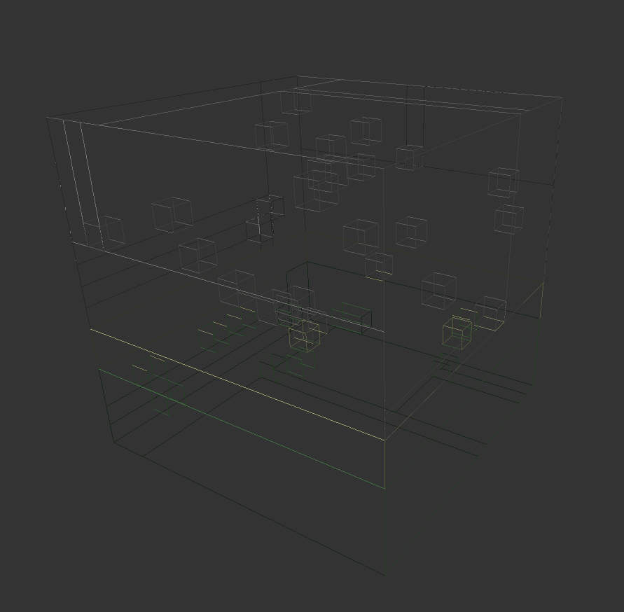
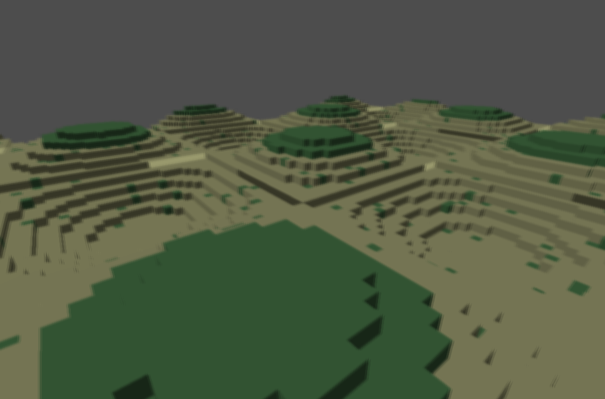
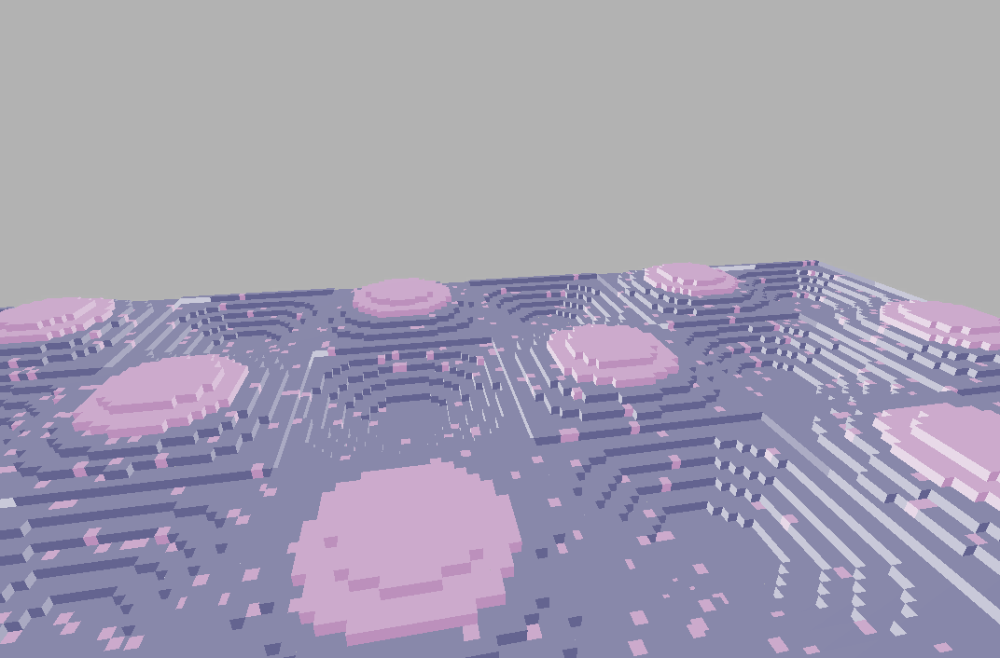
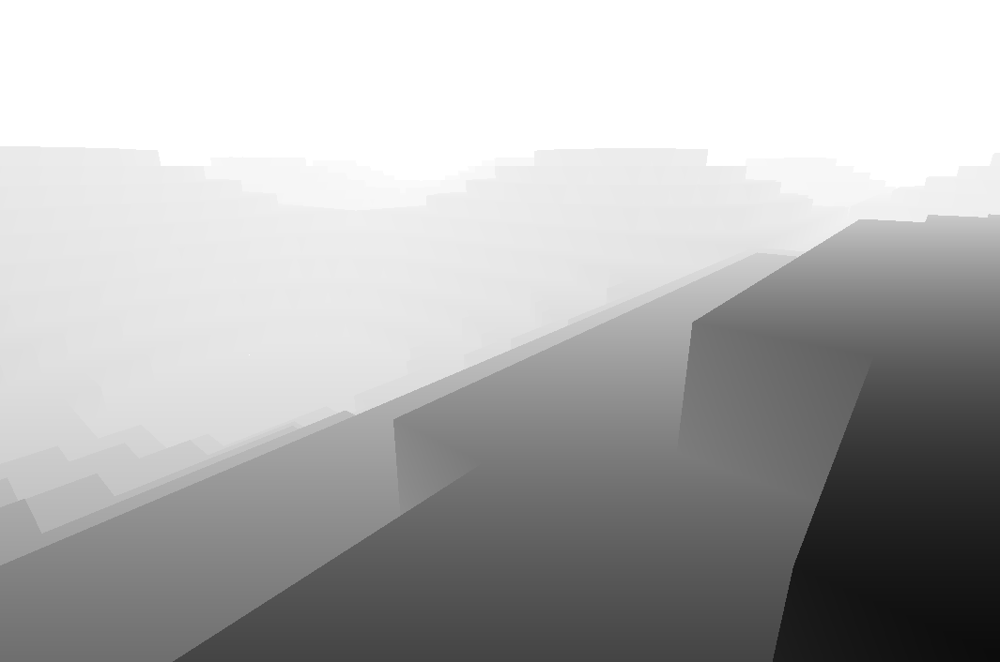

### Minecrap (wip)

Started this project to play around with voxel meshing, chunk management and multipass rendering. Ended up abandoning it due to the scope being too big. Still learned some stuff along the way.

#### Some pictures

To keep fps reasonable,  greedy meshing is required:

|                            Solid                             |                        Wireframe                        |
| :----------------------------------------------------------: | :-----------------------------------------------------: |
|  |  |

Played around with FBOs, to get some post process effects:

|                        Gaussian Blur                        |                     Inverted Colors                     |                        Z-buffer                        |
| :---------------------------------------------------------: | :-----------------------------------------------------: | :----------------------------------------------------: |
|  |  |  |

